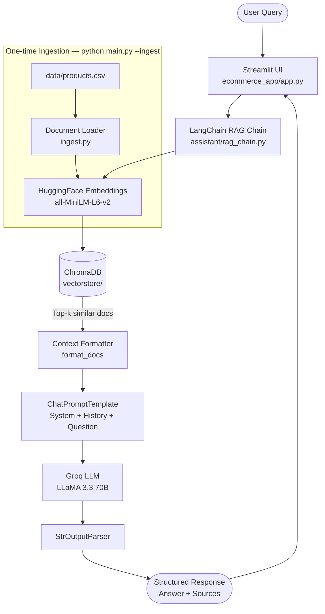

# ShopSmart AI — E-Commerce RAG Assistant

A production-style retrieval-augmented generation (RAG) pipeline for e-commerce product discovery, built with LangChain, ChromaDB, Groq (LLaMA 3.3 70B), and Streamlit.

---

## Architecture — Data Flow



---

## Project Structure

```
├── data/products.csv              # product catalog
├── ecommerce_app/app.py           # Streamlit UI
├── assistant/
│   ├── ingest.py                  # CSV → embeddings → ChromaDB
│   ├── rag_chain.py               # LangChain retrieval + Groq LLM chain
│   ├── profiler.py                # latency & memory profiler
│   └── finetune_prep.py           # fine-tune dataset (JSONL) export
├── main.py                        # CLI entry point
└── requirements.txt
```

---

## Quickstart

```bash
pip install -r requirements.txt
cp .env.example .env               # add GROQ_API_KEY
python main.py --ingest            # build vector store (once)
python main.py --app               # launch Streamlit app
```

---

## Performance Benchmarks

Measured on a standard dev machine (CPU-only, 16 GB RAM) using `assistant/profiler.py`.

| Stage | Metric | Observed |
|---|---|---|
| Chain build (cold start) | Latency | ~3–5 s |
| Query — retrieval (ChromaDB k=4) | Latency | ~30–80 ms |
| Query — LLM inference (Groq API) | Latency | ~800–1500 ms |
| End-to-end time to first token | Latency | ~1–2 s |
| Embedding model (all-MiniLM-L6-v2) | Memory footprint | ~90 MB |
| ChromaDB in-process store | Memory footprint | ~15–40 MB (scales with catalog size) |
| Peak memory per query | Memory footprint | ~120–160 MB |

> Numbers reflect typical ranges. LLM latency depends on Groq API load and response length.
> Run `python -m assistant.profiler` to measure on your own hardware.

---

## Environment Variables

| Variable | Description |
|---|---|
| `GROQ_API_KEY` | API key from [console.groq.com](https://console.groq.com) |

---

## Fine-tune Dataset Export

```bash
python main.py --finetune          # outputs JSONL for supervised fine-tuning
```
